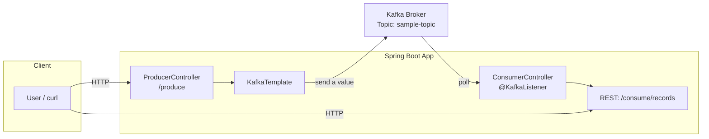
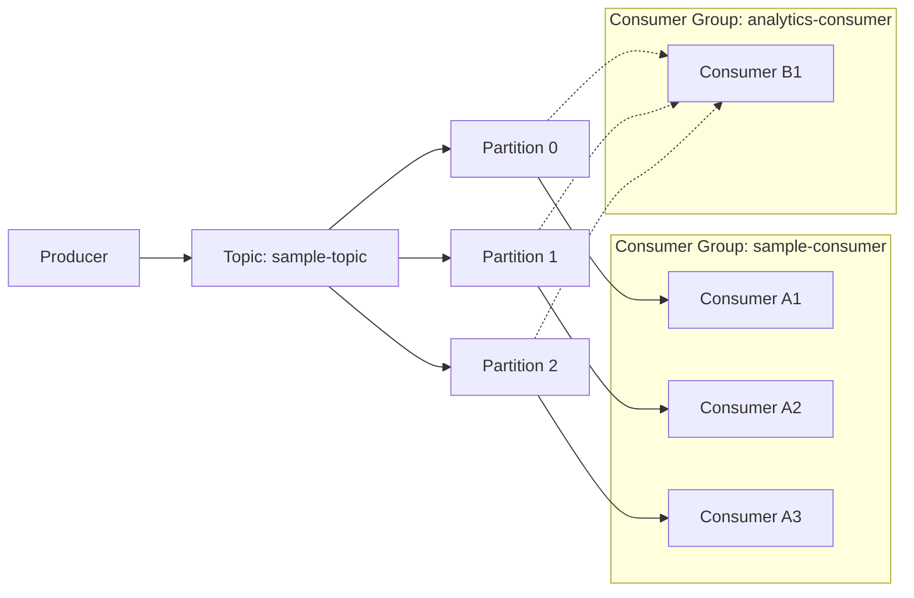

# README.md

SpringアプリケーションとDocker上で起動したKafkaを連携させて動かすサンプルアプリケーションです。

## アーキテクチャ概要
アプリがRESTで受けたリクエストをKafkaに発行し、Consumerが購読して処理します。

## 起動手順
- 依存: Docker, Docker Compose, JDK 21
- Kafka起動: `docker compose up -d`
- アプリ起動: `./gradlew bootRun`

主要設定（`src/main/resources/application.properties`）
- `spring.kafka.bootstrap-servers=localhost:29092`
- `app.kafka.topic=sample-topic`
- `app.kafka.consumer-group=sample-consumer`

## 動作確認
- 送信（GET）: `curl "http://localhost:8080/produce?message=hello"`
- 送信（POST）: `curl -X POST http://localhost:8080/produce -H "Content-Type: application/json" -d '{"value":"hello"}'`
- 受信ログ: アプリ標準出力に `Consumed message: topic=... value=...` がINFOで出力されます。
- 受信一覧（REST）: `curl http://localhost:8080/consume/records`
- CLIで直接確認（コンテナ内）:
  - `docker compose exec -it kafka bash -lc "kafka-console-consumer --bootstrap-server localhost:9092 --topic sample-topic --from-beginning"`

## トラブルシュート
- Kafkaが未起動: `docker compose ps` と `docker compose logs -f kafka` を確認。
- トピック未作成時: `docker compose exec -it kafka bash -lc "kafka-topics --bootstrap-server localhost:9092 --create --topic sample-topic --partitions 1 --replication-factor 1"`
- ポート競合: アプリは `8080`、Kafkaホスト向けは `29092` を使用しています。

## 補足: Consumer Group ID のイメージ
同じ group.id のコンシューマはトピックのパーティションを分担して処理し、異なる group.id のコンシューマはそれぞれ独立に全メッセージを消費します（ブロードキャスト的）。

- 同一グループ: 1パーティションにつき同時に処理するコンシューマは1つ。台数を増やすと負荷分散（パーティション数まで有効）。
- 別グループ: それぞれが独立の読み取り位置（オフセット）を持ち、全メッセージを受け取れる。
- オフセットはグループ単位で管理され、再起動やスケール時も処理位置が維持されます。
